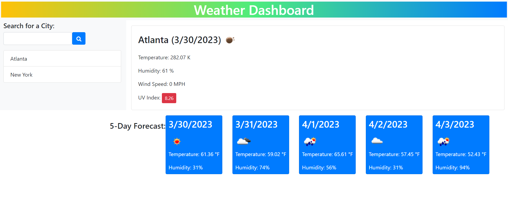

# Weather Dashboard

## Description
A Weather Dashboard to see the weather outlook for multiple cities, 5 day forcast included. Great for traveling.

## Usage
Use the search bar to search for a city that you would like to see the forecast for. When you search for a city, it'll save the city under the search bar for future use. When clicking on a saved city, or searching for a new one, it will display the city's name, current date, an icon representing weather conditions, temperature, humidity, wind speed, and the UV index. Below today's weather, the 5-Day forcast will be displayed. The 5-Day forecast shows the dates, icons representing weather conditions, temperatures, and humidity.

## Screenshot

## Link
[Weather Dashboard]()